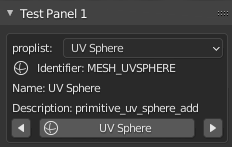

# Multifunction_operator
Blender 2.9x example panel utilizing a single operator to perform different functions based on enumerated list value. Based on https://blenderartists.org/t/how-to-structure-add-on-code/1288322/2.

* Example using predefined enumerated list to pass an argument to a single operator that will perform a unique operation based on the enumerated list selection.